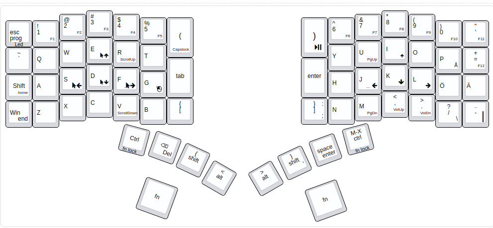

# Finnish Programmers Keyboardio Model 01 Firmware

Modified firmware for the Keyboardio Model 01
https://github.com/keyboardio/Model01-Firmware

# Description 

Finnish layout with optimizations for programmers. 

Features:

* Basic Finnish layout for typing (excluding å which is under a modifier)
* SpaceCadet overloads for all modifiers 
* M-x in a key

# Requirements

* https://github.com/jdlien/Kaleidoscope-LEDEffect-FunctionalColor (no?)
* Right alt set as the compose key. 
* If you have ever used Chrysalis, make sure *use custom layers only is disabled* in Keyboard Settings.

## TODOS

* Remove the reduncancy in the layout, maybe reconsider the led and any key usage, they might be too far away.

# Download and install

Follow [Kelidoscope Wiki](https://github.com/keyboardio/Kaleidoscope/wiki) installation instructions.

# Build and flash the firmware

Follow the [Kaleidoscope Arduino Instructions](https://github.com/keyboardio/Kaleidoscope/wiki/Install-Arduino).

# Link

[http://www.keyboard-layout-editor.com/#/gists/5f671f910b8b7483b8d1b4dc7199ecee](http://www.keyboard-layout-editor.com/#/gists/5f671f910b8b7483b8d1b4dc7199ecee)
